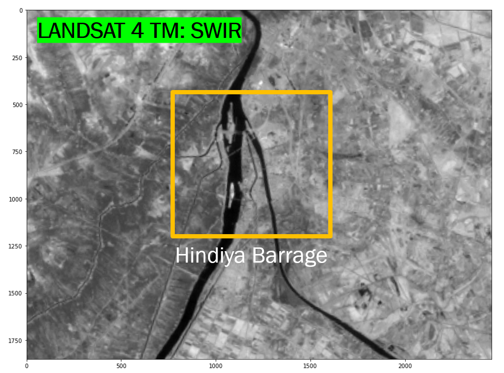
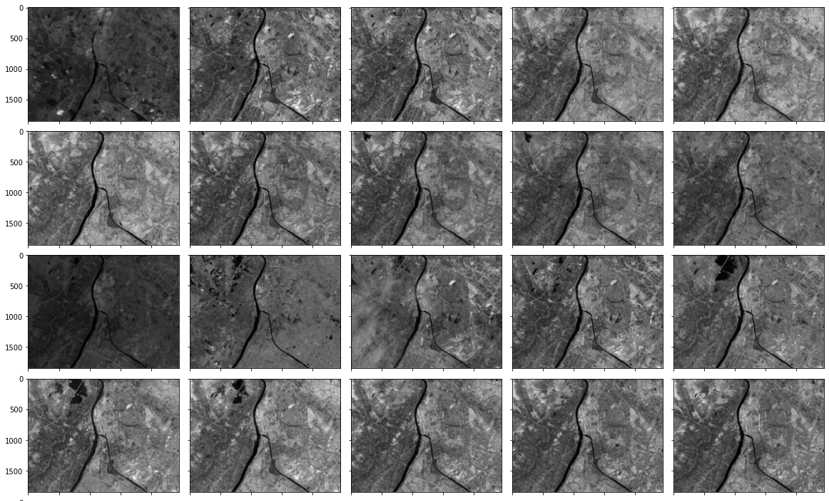
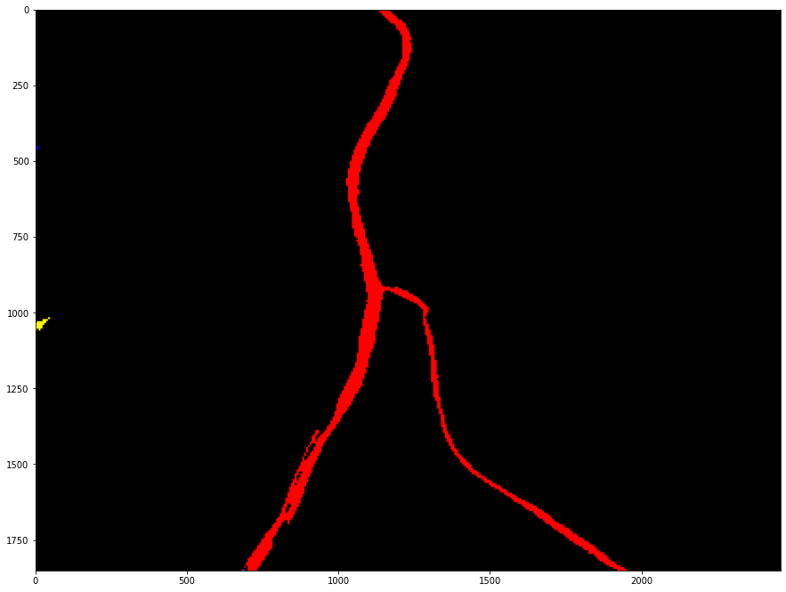
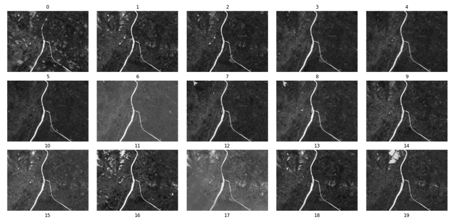
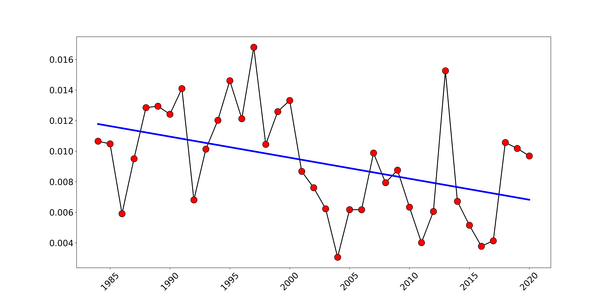
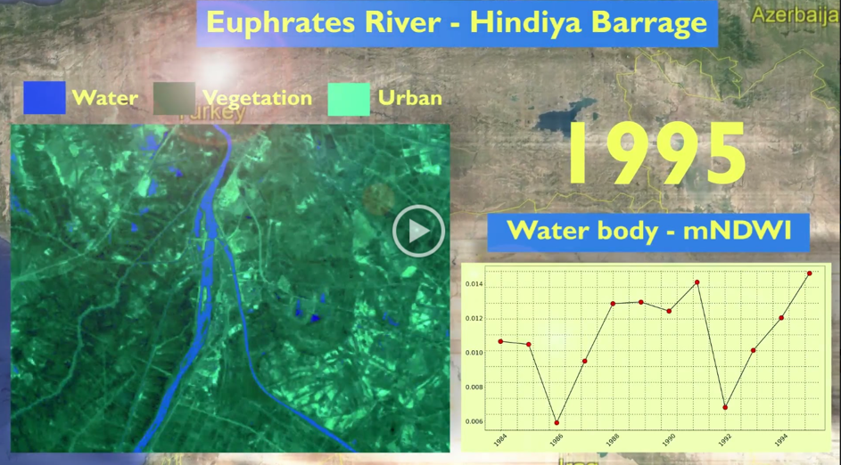

# DyingRivers-ESA
## INTRODUCTION
The **Space Hubs Network** and the **European Space Agency (ESA)** organized an open challenge; "AI4EARTH" to utilize earth observation data in analyzing the human impact on earth. This project herein, uses data from mulitple satellite missions to examine the state of one of the oldest rivers on the planet; the Euphrates.

Walkthroughs: 1. Sentinel Hub data acquisition 
    
2. Remote sensing indicies analysis 
    
3. Output statistics 
    

## PROBLEM STATMENT
The [Euphrates river](http://waterinventory.org/surface_water/euphrates-river-basin) is one of the most ancient rivers on earth. Recently, various [reports](https://www.france24.com/en/live-news/20210830-desert-drying-euphrates-threatens-disaster-in-syria) show a significant decline in downstream waterflow, accompanied by a general deterioration in the basin. Referring to the streamgage records isn't a viable option due to long gaps in the gaging data. 

A viable solution is to resort to earth observation (EO) data to deduce a metric; analogous to river streamgage in its role of describing the state of the river's body and its basin across time. To this end, a set of remote sensing (RS) indicies could be calculated for a given river section. The closest RS index that would hold information about a water body is the Normalized Difference Water Index (mNDWI) [(Xu, 2006)](https://doi.org/10.1080/01431160600589179).

### ROI: Hindiya Barrage - IRAQ
The selected region of interest (ROI) was the **“Hindiya Barrage”** (Latitude 32° 43′ 01″ N, Longitude 44° 16′ 01″ E) along the Euphrates river in Iraq. for which the following indices were calculated:
1. The Normalized Difference Water Index (mNDWI). 
2. The Normalized Difference Vegetation Index (NDVI).  
3. The Normalized Built-up Index (NBI). 

     
    <i>Hindiya Barrage region-Landsat-4-TM: SWIR Band</i>

## DATA ACQUISITION: SENTINEL API
The data was composed of multi-spectral satellite imagery. The data was acquired through **[Sentinel Hub](https://www.sentinel-hub.com/) cloud API**. The imagery was obtained from 3 different satellite missions **(landsat 4-5, Landsat 8, sentinel 2)** to cover the time span from 1983 to 2021, acquiring 1 image per month. This amounts to 37 years at 1 month temporal resolution.

1. LANDSAT 4/5 TM: 1984 - Dec. 21, 2012  
Collection 2 Level 1 Data
2. LANDSAT 8: Feb 2013 - 31 dec 2015 
Collection Landsat 8 L1
3. SENTINEL 2: Jan 2016 - 31 Sept 2021 
Collection: sentinel-2-l1c

     
    <i>Hindiya barrage: Landsat 4 & 5 missions</i> 

    
     
    <i><b>Left:</b> Sentinel-2 RGB composite</i>
    <i><b>Right:</b> River Surface Water Extent (SWE)</i> 

## REMOTE SENSING INDICIES
All imagery ran through a simple preprocessing pipline to extract the ROI square boundary and to mean center the image. 
*image_centered = image - min(image) / ((max(image) - min(image))*

Using the mean-centered image above the following remote sensing indicies were calculated: 

1. The Normalized Difference Water Index (mNDWI) 
   *mNDWI = (Green - SWIR) / (Green + SWIR)*
2. The Normalized Difference Vegetation Index (NDVI)  
*NDVI = (NIR - Red) / (NIR + Red)*

3. The Normalized Built-up Index (NBI) 
*NBI = (Red * SWIR) / NIR*  

*where NIR is near infra-red and SWIR is Short wave infra-red of the electromagnetic spectrum*.

     
    <i>Normalized Difference Water Index (mNDWI)</i> 
    <i>1 month temporal resolution</i> 

## RESULTS
The analysis was summarized into an infograph that showed the trend of the mNDWI over 37 years with at a 1 month resolution.

     
    <i>Normalized Difference Water Index (mNDWI)</i> 
    <i>1 month temporal resolution</i> 

.

### **OUTPUT INFOGRAPH:** Play the video below.

